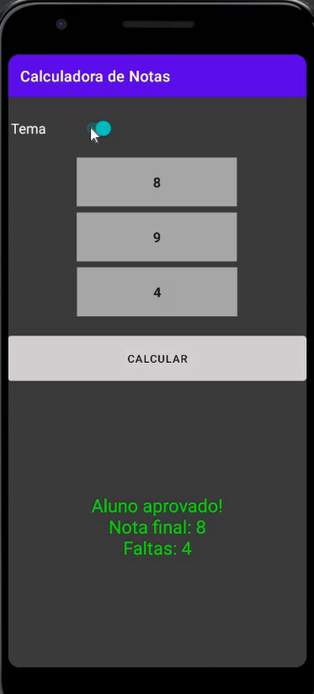

<h2>Calculadora de notas </h2>

 Este projeto foi incentivado pela Digital Innovation One, no Bootcamp Everis Kotlin. Foi realizado um aplicativo medidor de notas e faltas que exibirá para o aluno se ele será ou não aprovado na disciplina. As regras de negócio são: para um aluno ser aprovado, ele pode ter no máximo 10 faltas e uma média mínima de 6, onde esta é calculada pela média aritmétrica das duas notas obtidas em provas. ​​

Para realizar este projeto, foi utilizado a linguagem de programação Kotlin e a IDE Android Studio. :iphone:

<h3>Objetivos:</h3> 

- Criar aplicativo básico sobre aprovação de alunos :white_check_mark:

<h3> Além do esperado:</h3>

- Criação da funcionalidade de esconder o teclado ao pressionar o botão "calcular" :white_check_mark:
- Criação da funcionalidade de temas :white_check_mark:
- Centralização dos textos nas entradas sobre notas e faltas, além de destaque para facilitar a visualização :white_check_mark: 
- Alteração do teclado padrão para o númerico :white_check_mark:

<h3>Como o projeto ficou: </h3>

<h3>Como o Projeto era: </h3>

Dessa forma, caso o usuário colocasse alguma letra ou caractere espercial na parte de entrada e tentasse calcular seu resultado, nosso aplicativo teria erro e fecharia. Mudando para o teclado somente de números, evito esse problema.

Além disso, era trabalhoso fechar o teclado, visto que ele ficava em cima do resultado, e ao tocar no "enter", ele não saia, como normalmente acontece, desse modo o usuário tinha que clicar na opção de voltar do celular para poder ver o resultado. Assim, essa funcionalidade nova facilitou muito o uso do aplicativo.

